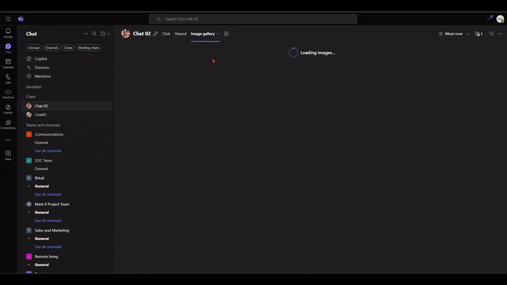

# Teams Chat Image Gallery

A Microsoft Teams application that creates a beautiful image gallery from all images shared in a Teams chat. The app fetches images from your chat history and displays them in an elegant, responsive gallery with lightbox viewing capabilities.

This application solves a key limitation in Microsoft Teams: images that are copied and pasted (rather than uploaded as attachments) don't appear in the "Shared" tab. Our gallery gives you easy access to all shared images without endless scrolling through chat history.

Built as a frontend-only application to minimize complexity and maintenance overhead. Can be extended with a backend API if additional security requirements arise.

## What does this app do?

This Teams application:

- **Displays all images** from your current Teams chat in a beautiful gallery layout
- **Provides lightbox viewing** - click on any image to view it full-screen with zoom, slideshow, and navigation features
- **Loads images progressively** - uses infinite scroll to load more images as you browse
- **Works seamlessly in Teams** - integrates directly into your Teams chat as a tab
- **Maintains image quality** - fetches high-resolution versions of shared images
- **Supports authentication** - uses single sign-on (SSO) to securely access your chat data

Perfect for Teams channels or group chats where lots of images are shared - now you can easily browse through all of them in one organized view!

This app uses the [On-Behalf-Of flow](https://learn.microsoft.com/en-us/azure/active-directory/develop/v2-oauth2-on-behalf-of-flow) to implement SSO and make authenticated requests to Microsoft Graph to fetch chat images.

## Built With

- **[React Photo Album](https://github.com/igordanchenko/react-photo-album)** - Beautiful responsive photo gallery component
- **[Yet Another React Lightbox](https://github.com/igordanchenko/yet-another-react-lightbox)** - Modern lightbox with zoom, slideshow, and navigation
- **[Fluent UI React Components](https://github.com/microsoft/fluentui)** - Microsoft's design system for consistent Teams integration
- **[Microsoft Graph API](https://docs.microsoft.com/en-us/graph/)** - For secure access to Teams chat data

## Get started with the Teams Chat Image Gallery

> **Prerequisites**
>
> To run this application in your local dev machine, you will need:
>
> - [Node.js](https://nodejs.org/), supported versions: 18, 20, 22
> - A [Microsoft 365 account for development](https://docs.microsoft.com/microsoftteams/platform/toolkit/accounts)
>   Please note that after you enrolled your developer tenant in Office 365 Target Release, it may take couple days for the enrollment to take effect.
> - [Microsoft 365 Agents Toolkit Visual Studio Code Extension](https://aka.ms/teams-toolkit) version 5.0.0 and higher or [Microsoft 365 Agents Toolkit CLI](https://aka.ms/teamsfx-toolkit-cli)

1. First, select the Microsoft 365 Agents Toolkit icon on the left in the VS Code toolbar.
2. In the Account section, sign in with your [Microsoft 365 account](https://docs.microsoft.com/microsoftteams/platform/toolkit/accounts) if you haven't already.
3. Press F5 to start debugging which launches your app in Teams using a web browser. Select `Debug in Teams (Edge)` or `Debug in Teams (Chrome)`.
4. When Teams launches in the browser, select the Add button in the dialog to install your app to Teams.

**Congratulations**! You are running an application that displays a beautiful image gallery of all images shared in your Teams chat.



## What's included in the project

| Folder       | Contents                                                                                               |
| ------------ | ------------------------------------------------------------------------------------------------------ |
| `.vscode`    | VSCode files for debugging                                                                             |
| `appPackage` | Templates for the Teams application manifest                                                           |
| `src`        | The source code for the Teams Chat Image Gallery application, built with React and Fluent UI Framework |

The following are Microsoft 365 Agents Toolkit specific project files. You can [visit a complete guide on Github](https://github.com/OfficeDev/TeamsFx/wiki/Teams-Toolkit-Visual-Studio-Code-v5-Guide#overview) to understand how Microsoft 365 Agents Toolkit works.

| File                   | Contents                                                                                                                                                                                                                                                |
| ---------------------- | ------------------------------------------------------------------------------------------------------------------------------------------------------------------------------------------------------------------------------------------------------- |
| `m365agents.yml`       | This is the main Microsoft 365 Agents Toolkit project file. The project file defines two primary things: Properties and configuration Stage definitions.                                                                                                |
| `m365agents.local.yml` | This overrides `m365agents.yml` with actions that enable local execution and debugging.                                                                                                                                                                 |
| `aad.manifest.json`    | This file defines the configuration of Microsoft Entra app. This template will only provision [single tenant](https://learn.microsoft.com/azure/active-directory/develop/single-and-multi-tenant-apps#who-can-sign-in-to-your-app) Microsoft Entra app. |

## Build process for hosting

The app can be hosted in a Static Web App or any kind of other hosting services.

Pass the Client ID and Login Page URL as environment variables before building like below:

```powershell
$env:VITE_START_LOGIN_PAGE_URL="https://<<HOST-DOMAIN>>/auth-start.html"; $env:VITE_CLIENT_ID="<<CLIENT-ID>>"; npm run build
```

## Limitations and Technical Challenges

### Teams CDN Image URL Incompatibility with Desktop Clients

The app was initially designed to use Teams CDN image URLs to display images directly. This approach significantly reduced Microsoft Graph API calls and worked perfectly in the browser version of Teams.

However, we discovered that **Teams CDN URLs require authentication headers** that are not automatically passed in desktop clients. This caused images to fail loading with authentication errors when users accessed the app through the Teams desktop application.

**Solution Implemented:**

- Refactored from direct CDN URLs to Microsoft Graph API blob fetching
- Added `fetchTeamsImageAsBlobUrl()` function that:
  - Makes authenticated requests to fetch image data
  - Converts response to blob URLs for secure local display
  - Handles authentication token management

**Trade-offs:**

- ✅ **Pro**: Works consistently across all Teams clients (browser, desktop, mobile)
- ✅ **Pro**: Proper authentication and security handling
- ❌ **Con**: Increased API calls and bandwidth usage
- ❌ **Con**: Additional processing time for image loading

This refactoring ensures the app provides a consistent experience regardless of how users access Teams, prioritizing reliability over performance optimization.
